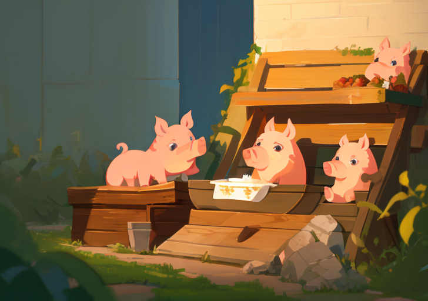

# 🐷 Koryto 🐷

> Pronounced like _corrito_, which is pronounced as if you combined _coroutine_ and _burrito_, because everyone knows coroutines are [burritos](https://blog.plover.com/prog/burritos.html) in the category of endofunctors.

Game loop focused async executor for all your coroutine needs. Inspired by [macroquad's experimental coroutines](https://docs.rs/macroquad/latest/macroquad/experimental/coroutines/), [the cosync crate](https://docs.rs/cosync/latest/cosync/), [Unity's amazing coroutines](https://docs.unity3d.com/ScriptReference/MonoBehaviour.StartCoroutine.html), and lastly [Godot's coroutines](https://docs.godotengine.org/en/stable/tutorials/scripting/gdscript/gdscript_basics.html#awaiting-for-signals-or-coroutines) which for a while [weren't true burritos](https://github.com/godotengine/godot/issues/24311).

> Koryto in Czech means trough, which is the thingy pigs eat from.

Koryto is single threaded and simple. The executor context `Koryto` expects to be polled every frame with the game's _delta time_.

## FAQ

### Is this stable?

No.

### Why not just use `cosync` when this does exactly the same thing?

While [`cosync`](https://docs.rs/cosync/latest/cosync/) does work its API is a little more flexible than feels
convenient for games. [Macroquad's
coroutines](https://docs.rs/macroquad/latest/macroquad/experimental/coroutines/index.html)
are more closely aligned with the philosophy of this crate. If you like
`cosync`, keep using it!
